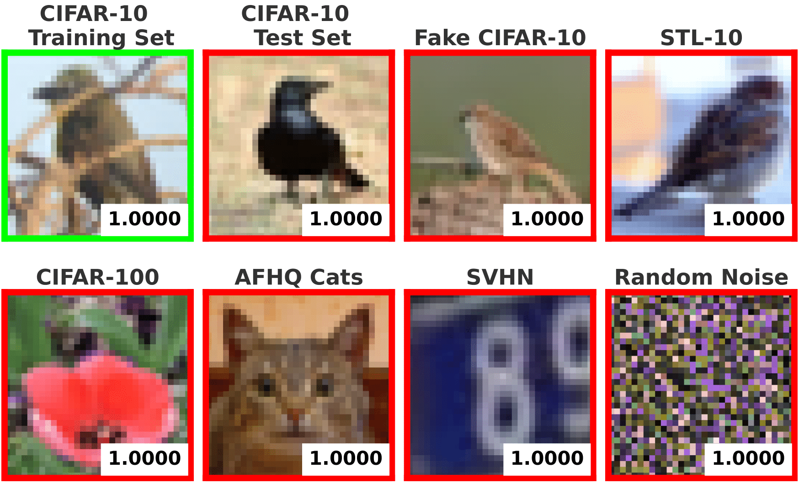
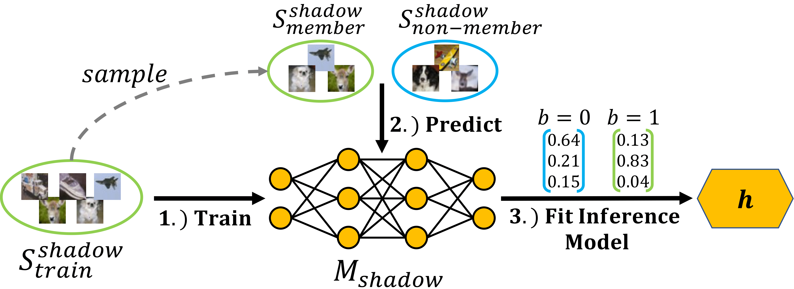
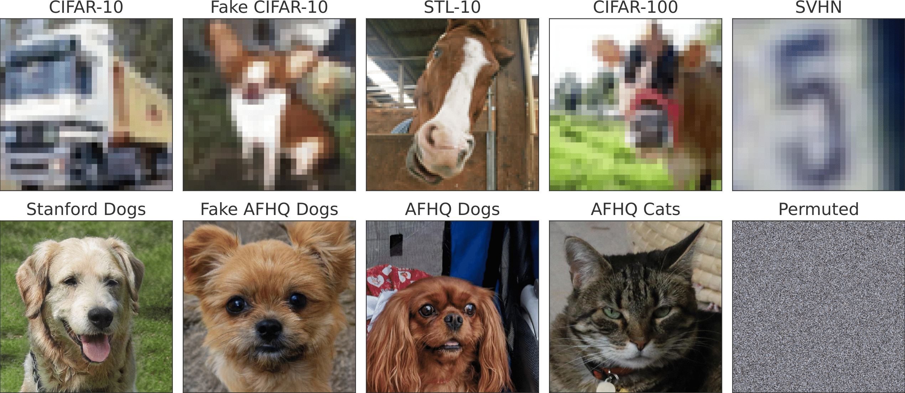

# Do Not Trust Prediction Scores for Membership Inference Attacks

  <center>
  
  </center>


Abstract: *Membership inference attacks (MIAs) aim to determine whether a specific sample was used to train a predictive model. Knowing this may indeed lead to a privacy breach. Arguably, most MIAs, however,  make use of the model's prediction scores---the probability of each output given some input---following the intuition that the trained model tends to behave differently on its training data. We argue that this is a fallacy for many modern deep network architectures, e.g., ReLU type neural networks produce almost always high prediction scores far away from the training data. Consequently, MIAs will miserably fail since this behavior leads to high false-positive rates not only on known domains but also on out-of-distribution data and implicitly acts as a defense against MIAs. Specifically, using generative adversarial networks, we are able to produce a potentially infinite number of samples falsely classified as part of the training data. In other words, the threat of MIAs is overestimated and less information is leaked than previously assumed. Moreover, there is actually a trade-off between the overconfidence of classifiers and their susceptibility to MIAs: the more classifiers know when they do not know, making low confidence predictions far away from the training data, the more they reveal the training data.*  
[Arxiv Preprint (PDF)](https://arxiv.org/pdf/2111.09076.pdf)

## Membership Inference Attacks
<center>

<br \>

</center>

In a general MIA setting, as usually assumed in the literature, an adversary is given an input x following distribution D and a target model which was trained on a training set with size S_train consisting of samples from D. The adversary is then facing the problem to identify whether a given x following D was part of the training set S_train. To predict the membership of x, the adversary creates an inference model h. In score-based MIAs, the input to h is the prediction score vector produced by the target model on sample x (see first figure above). Since MIAs are binary classification problems, precision, recall and false-positive rate (FPR) are used as attack evaluation metrics.

All MIAs exploit a difference in the behavior of the target model on seen and unseen data. Most attacks in the literature follow [Shokri et al.](https://arxiv.org/pdf/1610.05820.pdf) and train so-called shadow models shadow models on a disjoint dataset S_shadow drawn from the same distribution D as S_train. The shadow model is used to mimic the behavior of the target model and adjust parameters of h, such as threshold values or model weights. Note that the membership status for inputs to the shadow models are known to the adversary (see second figure above).

# Setup and Run Experiments

## Setup StyleGAN2-ADA
To recreate our Fake datasets containing synthetic CIFAR-10 and Stanford Dog images, you need to clone the official [StyleGAN-2-Pytorch](https://github.com/NVlabs/stylegan2-ada-pytorch) repo into the folder ```datasets```.
```
cd datasets
git clone https://github.com/NVlabs/stylegan2-ada-pytorch.git
rm -r --force stylegan2-ada-pytorch/.git/
```
You can also safely remove all folders in the ```/datasets/stylegan2-ada-pytorch``` folder but ```/dnnlib``` and ```/torch_utils```.

## Setup Docker Container
To build the Docker container run the following script:
```bash
./docker_build.sh -n confidence_mi
```
To start the docker container run the following command from the project's root:
```bash
docker run --rm --shm-size 16G --name my_confidence_mi --gpus '"device=0"' -v $(pwd):/workspace/confidences -it confidence_mi bash
```

## Download Trained Models
We provide our trained models on which we performed our experiments. To automatically download and extract the files use the following command:
```
bash download_pretrained_models.sh
```
To manually download single models, please visit [https://hessenbox.tu-darmstadt.de/getlink/fiBg5znMtAagRe58sCrrLtyg/pretrained_models](https://hessenbox.tu-darmstadt.de/getlink/fiBg5znMtAagRe58sCrrLtyg/pretrained_models).

## Reproduce Results from the Paper
All our experiments based on CIFAR-10 and Stanford Dogs can be reproduced using the pre-trained models by running the following scripts:
```bash
python experiments/cifar10_experiments.py
python experiments/stanford_dogs_experiments.py
```

If you want to train the models from scratch, the following commands can be used:
```bash
python experiments/cifar10_experiments.py --train
python experiments/stanford_dogs_experiments.py --train --pretrained
```

We use command line arguments to specify the hyperparameters of the training and attacking process. 
Default values correspond to the parameters used for training the target models as stated in the paper. 
The same applies for the membership inference attacks. 
To train models with label smoothing, L2 or LLLA, run the experiments with ```--label_smoothing```, 
```--weight_decay``` or ```--llla```. We set the seed to ```42``` (default value) for all experiments. 
For further command line arguments and details, please refer to the python files.

Attack results will be stored in csv files at 
```/experiments/results/{MODEL_ARCH}_{DATASET_NAME}_{MODIFIERS}_attack_results.csv``` and state precision, recall, 
fpr and mmps values for the various input datasets and membership inference attacks. 
Results for training the target and shadow models will be stored in the first column at 
```/experiments/results/{MODEL_ARCH}_{DATASET_NAME}_{MODIFIERS}_performance_results.csv```. 
They state the training and test accuracy, as well as the ECE. 


## Datasets
All data is required to be located in ```/data/```. To recreate the Fake datasets using StyleGAN2-ADA to 
generate CIFAR-10 and dog samples, use ```/datasets/fake_cifar10.py``` and ```/datasets/fake_dogs.py```. 
For example, Fake Dogs samples are located at ```/data/fake_afhq_dogs/Images``` after generation. 
If the files are missing or corrupted (checked by MD5 checksum), the images will be regenerated to restore the 
identical datasets used in the paper. This process will be automatically called when running one of the experiments.
We use various datasets in our experiments. The following figure gives a short overview over the content and visual styles of the datasets.  
<center>

</center>


## Citation
If you build upon our work, please don't forget to cite us.
```
@misc{hintersdorf2021trust,
      title={Do Not Trust Prediction Scores for Membership Inference Attacks}, 
      author={Dominik Hintersdorf and Lukas Struppek and Kristian Kersting},
      year={2021},
      eprint={2111.09076},
      archivePrefix={arXiv},
      primaryClass={cs.LG}
}
```

## Implementation Credits
Some of our implementations rely on other repos. We want to thank the authors for making their code publicly available. 
For license details refer to the corresponding files in our repo. For more details on the specific functionality, please visit the corresponding repos.
- CIFAR10 models: https://github.com/kuangliu/pytorch-cifar
- Label smoothing: https://github.com/seominseok0429/label-smoothing-visualization-pytorch
- LLLA: https://github.com/wiseodd/last_layer_laplace
- StyleGAN2-ADA: https://github.com/NVlabs/stylegan2-ada-pytorch
